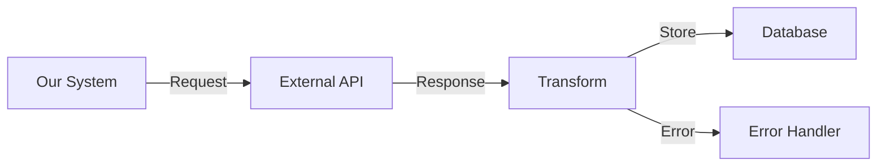
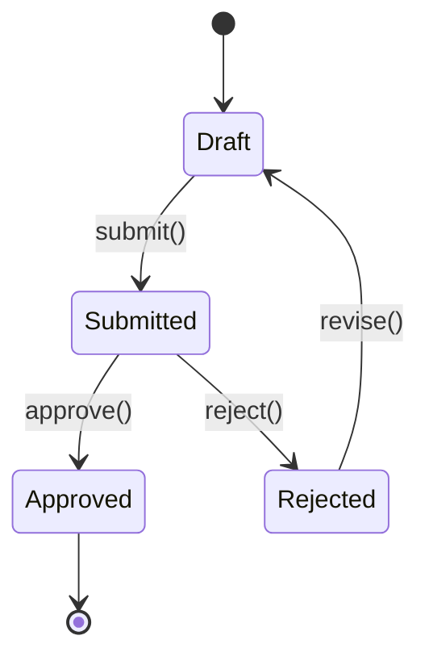

# Spec-Driven Development Protocol

> Write comprehensive specifications before implementation for API integrations and features.
> Based on analysis of SDD approaches by GitHub (spec-kit), Tessl, and Kiro, with lessons from MDD history.
> Works with any AI coding agent. Portable: copy to any project's `.ai-agents/skills/` or symlink from dotfiles.
> 
> Warning: SDD is an evolving concept with multiple interpretations and trade-offs. This skill provides practical guidance while acknowledging its limitations.

---

## Purpose

Create living specification documents that serve as the source of truth for both human developers and AI coding agents. However, recognize that "spec-driven" means different things to different tools and teams.

## Three Levels of SDD

Based on current tools and practices, SDD exists at three levels:

### 1. Spec-First (Most Common)
- Write spec before code for a specific task/feature
- Use spec to guide implementation
- Spec may be discarded after task completion
- **Best for:** New features, API integrations, one-time migrations
- **Tools:** All SDD tools support this level

### 2. Spec-Anchored (Emerging)
- Keep spec as living document after implementation
- Update spec when code changes
- Use for ongoing feature maintenance
- **Best for:** Core business logic, critical APIs, long-lived features
- **Challenges:** Synchronization burden, review overhead

### 3. Spec-as-Source (Experimental)
- Spec is the primary artifact; code is generated
- Developers edit spec, never code
- Code marked as generated (DO NOT EDIT)
- **Best for:** Highly constrained domains, configuration-heavy code
- **Challenges:** Non-determinism, debugging generated code, flexibility constraints

## Problem Size Guide

### 🐜 Tiny (Bug Fix, <2 hours)
**Skip formal SDD.** Write a brief problem statement in your PR/commit.

```markdown
## Bug: User email validation accepts invalid domains
- **Issue:** Regex doesn't check for TLD
- **Fix:** Update regex pattern to require valid TLD
- **Test:** Add cases for edge domains
```

### 🦊 Small (Minor Feature, 2-8 hours)
**Use lightweight spec-first approach.**

```markdown
## Feature: Add CSV Export
**Purpose:** Allow users to export search results as CSV
**Approach:** Add download button that triggers client-side CSV generation
**Success:** Users can download results with all visible columns
```

### 🦁 Medium (Multi-day Feature, 8-40 hours)
**Use full spec template with phases.**

[Full template below]

### 🐘 Large (Multi-week Epic, >40 hours)
**Break into multiple medium specs.** Create overview spec linking sub-specs.

## Context Window Considerations

AI agents have token limits. Manage spec verbosity:

1. **Keep specs under 2000 lines** - Beyond this, agents miss details
2. **Use references over repetition** - Link to API docs rather than copying
3. **Progressive detail** - Start high-level, add detail per section
4. **Separate concerns** - Multiple focused specs beat one giant spec

### What 50k Tokens Looks Like

**Token estimates for planning:**
- 1 token ≈ 4 characters or 0.75 words
- 50k tokens ≈ 37,500 words or ~150 pages of text

**Practical examples of 50k tokens:**
```
- 10-15 typical Medium-sized specs (3-5k tokens each)
- 1 massive spec with full API docs copied in (avoid this!)
- 50 lightweight specs for small features
- This entire SDD skill file × 25 copies
```

**Red flags you're approaching token limits:**
- AI starts missing details from early sections
- Responses become generic or skip specifications
- "I'll need to review the earlier parts..." messages
- Frequent context window errors

**Best practice:** Keep active specs under 20k tokens total for optimal AI performance.

## Spec Templates by Problem Type

### Template A: API Integration

```markdown
## Feature: [External Service] Integration
**API Docs:** [URL]
**Auth Type:** [OAuth2/API Key/etc]
**Rate Limits:** [requests/min]
**Problem Size:** [Small/Medium/Large]

### Integration Points
1. **Endpoint:** [HTTP method] [path]
   - **Purpose:** [what it does]
   - **Frequency:** [how often called]
   - **Criticality:** [can fail gracefully?]

### Data Flow


### Error Budget
- **Timeout:** [X seconds]
- **Retry:** [strategy]
- **Fallback:** [behavior if API down]

### Example Request/Response
```json
// Request
{
  "field": "value"
}

// Success Response (200)
{
  "id": "123",
  "status": "success"
}

// Error Response (400)
{
  "error": "Invalid field",
  "code": "VALIDATION_ERROR"
}
```
```

### Template B: State Machine Feature

```markdown
## Feature: [Process Name] State Machine
**States:** [list valid states]
**Triggers:** [what causes transitions]

### State Diagram


### State Rules
| From State | To State | Conditions | Side Effects |
|------------|----------|------------|--------------|
| Draft | Submitted | All fields valid | Email sent |
| Submitted | Approved | Has approver role | Update timestamp |

### Edge Cases
- [ ] State transition during concurrent updates
- [ ] Invalid state in database
- [ ] Missing required fields for transition
```

### Template C: Data Processing Pipeline

```markdown
## Feature: [Pipeline Name]
**Input:** [data source]
**Output:** [destination]
**Volume:** [records/day]
**SLA:** [processing time]

### Pipeline Stages
1. **Extract:** [source details]
2. **Validate:** [rules]
3. **Transform:** [mappings]
4. **Load:** [destination]

### Error Handling
- **Validation Failures:** Dead letter queue
- **Transform Errors:** Log and skip
- **Load Failures:** Retry with backoff

### Performance Requirements
- Process 10k records in < 5 minutes
- Memory usage < 512MB
- Parallelize up to 4 workers
```

## Avoiding Common Pitfalls

### The "Verschlimmbesserung" Problem
Making things worse while trying to improve them. Watch for:

1. **Spec Bloat:** 10-page spec for 2-hour task
2. **Abstraction Addiction:** Over-generalizing simple features  
3. **Review Paralysis:** More time reviewing specs than code
4. **Template Tyranny:** Forcing every task into rigid template

### The MDD History Lesson
Model-Driven Development failed because:
- Inflexible generated code
- Debugging nightmares
- Round-trip engineering problems

SDD risks the same if we:
- Treat specs as immutable truth
- Ignore pragmatic code changes
- Insist on spec-code synchronization at all costs

## Spec Review Strategies

### For Developers
1. **Skim structure first** - Is organization logical?
2. **Check examples** - Are they realistic?
3. **Verify testability** - Can you write tests from this?
4. **Question complexity** - Could this be simpler?

### For AI Agents
```markdown
When reviewing a spec, check:
- [ ] All required sections present
- [ ] Examples match described behavior
- [ ] Error cases identified
- [ ] No contradictions between sections
- [ ] Complexity matches problem size
```

## Real-World Examples

### Example 1: REST API Integration (Medium)

```markdown
## Feature: Payment Provider Webhooks
**API Docs:** https://payments.example/webhooks
**Auth Type:** HMAC signature validation
**Rate Limits:** No limit, but expects response in 10s
**Problem Size:** Medium

### Webhook Events
1. **payment.succeeded**
   - **Frequency:** ~100/day
   - **Criticality:** Must not miss
   - **Idempotency:** Use payment_id as key

2. **payment.failed**  
   - **Frequency:** ~20/day
   - **Criticality:** Must not miss
   - **Action:** Update order status, notify customer

### Security Validation
```python
def validate_webhook(payload, signature):
    expected = hmac.new(
        WEBHOOK_SECRET.encode(),
        payload.encode(),
        hashlib.sha256
    ).hexdigest()
    return hmac.compare_digest(expected, signature)
```

### Database Schema
```sql
CREATE TABLE webhook_events (
    id SERIAL PRIMARY KEY,
    event_id VARCHAR(255) UNIQUE NOT NULL,
    event_type VARCHAR(50) NOT NULL,
    payload JSONB NOT NULL,
    processed_at TIMESTAMP,
    created_at TIMESTAMP DEFAULT NOW()
);

CREATE INDEX idx_webhook_event_type ON webhook_events(event_type);
CREATE INDEX idx_webhook_processed ON webhook_events(processed_at) 
    WHERE processed_at IS NULL;
```

### Processing Flow
1. Receive webhook POST request
2. Validate HMAC signature (reject if invalid)
3. Check event_id uniqueness (return 200 if duplicate)
4. Store raw event in webhook_events table
5. Enqueue background job for processing
6. Return 200 immediately (within 10s)
7. Background job updates application state

### Error Scenarios
- **Invalid signature:** Return 401, log attempt
- **Duplicate event:** Return 200, skip processing
- **Unknown event type:** Store but don't process, alert team
- **Processing timeout:** Return 200, rely on background job
- **Database down:** Return 503, provider will retry
```

### Example 2: GraphQL Feature (Small)

```markdown
## Feature: Add User Preferences Query
**Purpose:** Expose user preferences via GraphQL
**Problem Size:** Small

### Schema Addition
```graphql
extend type User {
  preferences: UserPreferences!
}

type UserPreferences {
  theme: Theme!
  notifications: NotificationSettings!
  language: String!
}

enum Theme {
  LIGHT
  DARK
  AUTO
}

type NotificationSettings {
  email: Boolean!
  push: Boolean!
  frequency: NotificationFrequency!
}
```

### Resolver Implementation
- Load preferences with user (avoid N+1)
- Default values if not set
- Cache for 5 minutes

### Test Cases
- [ ] New user gets defaults
- [ ] Can query nested fields
- [ ] Respects field-level permissions
```

## When NOT to Use SDD

1. **Exploratory Prototypes** - Structure emerges through iteration
2. **Emergency Hotfixes** - Fix first, document later
3. **Pure Refactoring** - Tests are your spec
4. **Configuration Changes** - The config file is the spec
5. **UI Polish** - Visual changes need visual review, not text specs

## Tooling Reality Check

### Current Tool Limitations

| Tool | Strengths | Weaknesses | Best For |
|------|-----------|------------|----------|
| **Kiro** | Simple 3-step flow | Overkill for small tasks, no spec reuse | Medium features |
| **spec-kit** | Flexible, customizable | Verbose, many files to review | Large projects |
| **Tessl** | Spec-as-source pioneer | 1:1 spec-to-file mapping, beta | Experimental projects |

### Token Window Management
- **Claude-3**: ~200k tokens (default), 1M in beta
- **GPT-4**: 128k tokens
- **Practical limit**: Keep active specs under 50k tokens total

## Spec Maintenance Strategies

### Spec-First Only (Recommended Starting Point)
```bash
project/
├── docs/
│   └── specs/
│       └── archive/      # Old specs for reference
│           └── 2024-Q1/  # Completed features
└── active-specs/         # Current work only
    └── feature-x.md      # Delete after merge
```

### Spec-Anchored (For Critical Features)
```bash
project/
├── specs/
│   ├── api/             # Always current
│   │   └── auth.md      # Updated with code
│   ├── core/            # Business logic specs
│   └── archive/         # Deprecated features
```

### Spec-as-Source (Experimental)
```bash
project/
├── specs/
│   └── generated/       # These generate code
│       └── models.spec  # DO NOT edit code files
└── src/
    └── generated/       # Generated from specs
        └── models.js    # Has "DO NOT EDIT" header
```

## Quality Checklist by Problem Size

### Small (2-8 hours)
- [ ] Purpose stated clearly
- [ ] Success criteria defined
- [ ] Main edge case identified

### Medium (8-40 hours)
- [ ] All API contracts documented
- [ ] Error scenarios mapped
- [ ] Data models specified
- [ ] Phased implementation plan
- [ ] Test strategy outlined

### Large (>40 hours)
- [ ] Broken into sub-specs
- [ ] Dependencies mapped
- [ ] Performance requirements
- [ ] Security review done
- [ ] Rollback plan exists

## Pragmatic Recommendations

1. **Start with spec-first** - Don't commit to maintenance burden until proven valuable
2. **Match effort to risk** - Payment processing needs detailed specs; internal tools don't
3. **Embrace incompleteness** - 80% spec + iteration beats 100% spec paralysis
4. **Review code, not novels** - If spec review takes longer than coding, it's too much
5. **Let specs die** - Archive when feature stabilizes; resurrection is easier than maintenance

## The Reality of AI + Specs

### What Works Well
- AI catches inconsistencies between sections
- Generates boilerplate from good examples
- Suggests missing error cases
- Translates specs to test cases

### What Doesn't Work (Yet)
- AI misses context beyond the spec
- Non-deterministic code generation
- Can over-interpret vague requirements
- May ignore critical constraints buried in text

### Best Practices for AI Consumption
1. **Front-load critical constraints**
2. **Use consistent terminology**
3. **Provide complete examples**
4. **Explicitly state what NOT to do**
5. **Break complex logic into steps**

## Final Wisdom

Remember: Specs are a means, not an end. They should accelerate development and improve quality. If they don't, you're doing it wrong.

The best spec is one that:
- Gets everyone on the same page
- Prevents the obvious mistakes  
- Doesn't pretend to predict the future
- Can be thrown away when its job is done

As the source article noted: "A stale spec is worse than no spec." Keep them fresh or delete them.